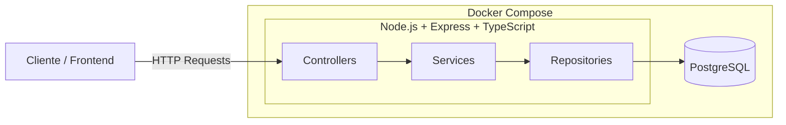
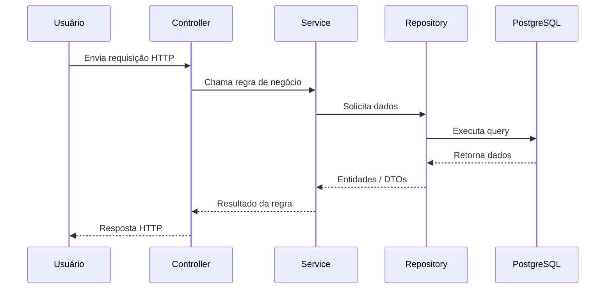

# 🧘‍♀️ Define Pilates — Sistema de Gestão para Estúdios de Pilates

O Define Pilates é um sistema completo de gestão para estúdios, permitindo administrar alunos, planos, assinaturas, aulas, agenda, horários de funcionamento e muito mais.
Ele utiliza uma arquitetura monorepo, separando frontend, backend e pacotes compartilhados.

## 📂 Estrutura do Projeto

```bash
define-pilates/
│
├── apps/
│   ├── backend/        # API em Node.js + TypeScript + Express (Drizzle ORM)
│   └── frontend/       # Interface em React + Vite + Tailwind + Shadcn UI
│
└── README.md
```

### Tecnologias Utilizadas

- Backend

  - Node.js
  - TypeScript
  - Express
  - Drizzle ORM
  - PostgreSQL
  - Zod
  - tsx
  - Dotenv

- Frontend

  - React
  - TypeScript
  - Vite
  - TailwindCSS
  - Shadcn UI
  - React Hook Form

- Infra / Dev
  - pnpm workspaces
  - Monorepo architecture
  - Docker
  - Vercel (frontend)

### 🚀 Instalação e Configuração

1️⃣ Pré-requisitos

Você precisa ter instalado:

- Node.js 18+
- Git
- Postgres instalado localmente ou conta no Neon

### 📦 Instalação

Clone o repositório:

```bash
git clone https://github.com/alvarosena/studio.git
cd studio
```

Instalar dependências:

```bash
pnpm install
```

```bash
cd apps/backend
pnpm install
```

Criar arquivo .env e inserir todos os valores das variáveis que estão dentro de .env.example

Dentro de apps/backend, execute:

```bash
docker compose up -d
pnpm run db:seed
```

Execute o script de seed:

```bash
pnpm run db:seed
```

Inicie a aplicação:

```bash
pnpm run dev
```

```bash
cd apps/frontend
pnpm install
pnpm run dev
```

Criar arquivo .env e inserir todos os valores das variáveis que estão dentro de .env.example

## 📐 Arquitetura



### 🔹 2. **Fluxo MVC + Camadas Internas**

Mostra como as camadas se conectam dentro do backend.


